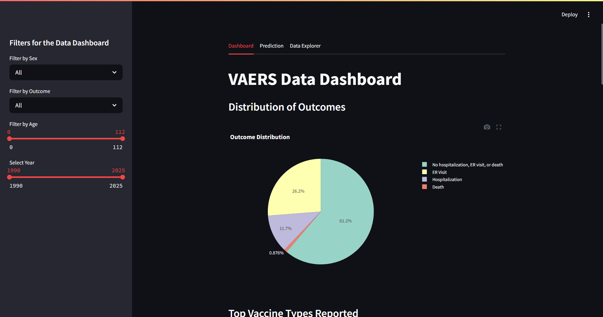
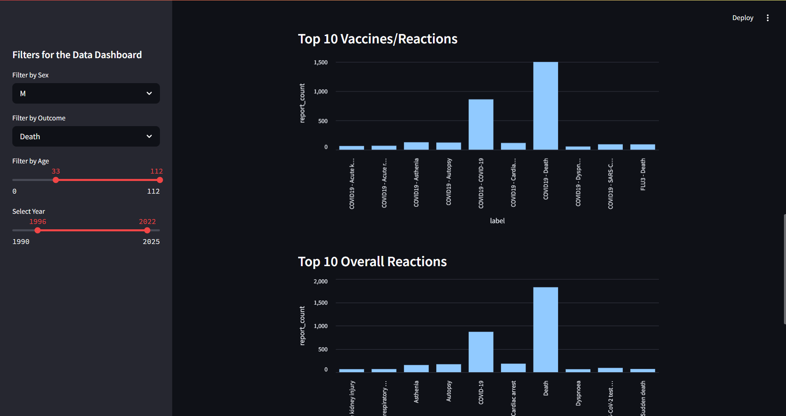
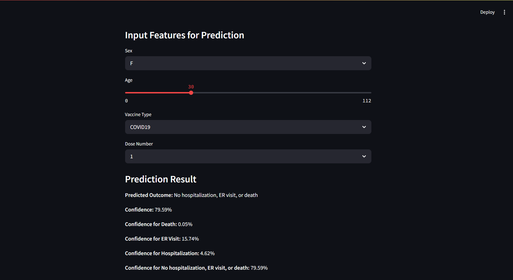
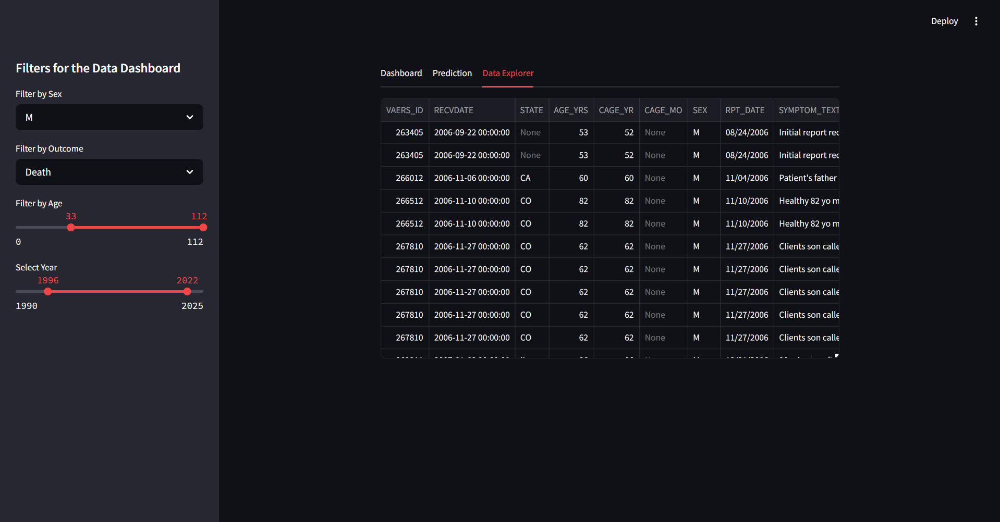

# VAERS Outcome Predictor

## How to download the data
[VAERS All Year Data](https://vaers.hhs.gov/eSubDownload/index.jsp?fn=AllVAERSDataCSVS.zip)

## How to run locally
1. PostgreSQL
   1. ```docker run --env=POSTGRES_PASSWORD=psw -p 5432:5432 -d postgres:latest```
2. Data Extractor
   1. ```python data_extraction.py```
3. Prediction Model
   1. ```python prediction_model.py```
4. Streamlit based Data Explorer
   1. ```streamlit run app.py```

## Data Explorer UI
### Main Tab
#### Default view

#### Top10 with adjusted filters


### Prediction Tab


### Data Explorer Tab

